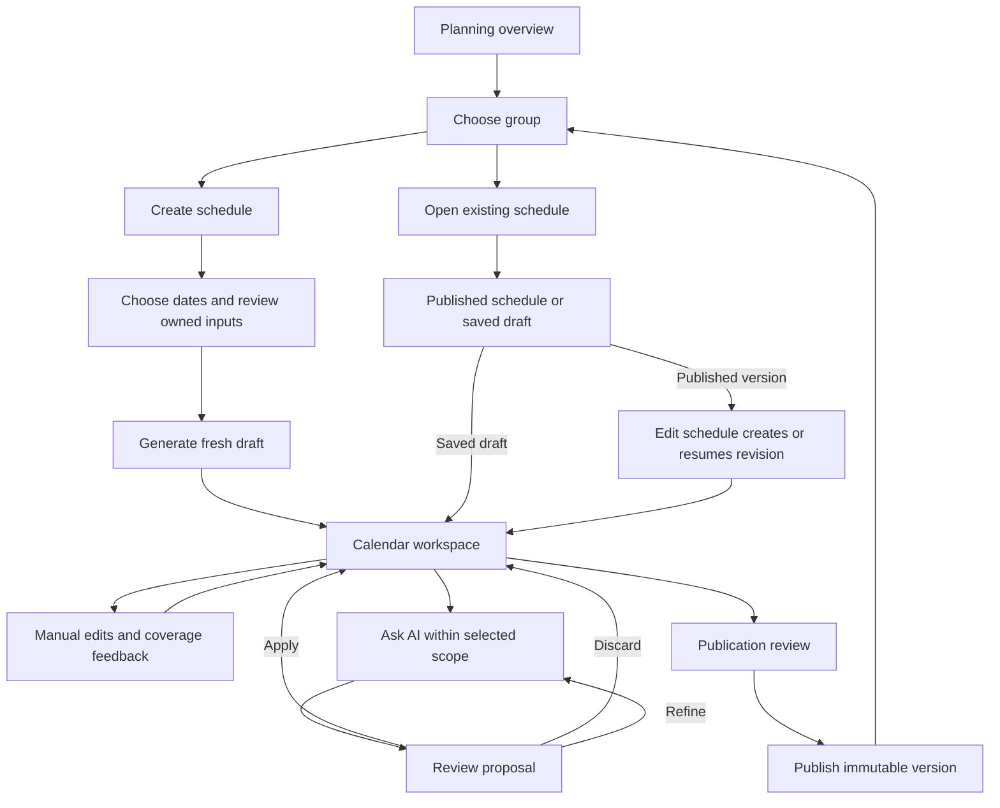

# Implement the group planning workflow

This change captures the product exploration and approved interaction direction. A new chat can implement it without reading the original conversation.

## Start here

Paste this into a new chat opened in this repository:

> Use the openspec-apply-change skill to implement `add-group-planning-workflow`. Start with `openspec/changes/add-group-planning-workflow/handoff.md`, then read proposal.md, design.md, all six capability specs, tasks.md, and wireframes/README.md. Follow the ordered tasks and keep their checkboxes current. The wireframes describe the user flow; implement real dated data, validation, persistence, and AI proposals rather than copying their demo logic. Preserve the agreed scope and documented assumptions. Verify both creation and existing-schedule revision flows, including cross-group conflicts and stale AI proposals.

Equivalent OpenSpec entry point: `/opsx:apply add-group-planning-workflow`.

The OpenSpec CLI was not on PATH in the proposal session. The following fallback worked without adding a project dependency:

```sh
npx --yes @fission-ai/openspec@1.3.1 status --change add-group-planning-workflow
npx --yes @fission-ai/openspec@1.3.1 instructions apply --change add-group-planning-workflow --json
```

Use the installed CLI if available and follow the apply skill's actual instructions.

## Agreed product decisions

1. Plan one group at a time for a chosen inclusive start/end date range.
2. Generate each new schedule fresh from settings and relevant exceptions. Do not copy the previous period.
3. Open an existing schedule through a separate flow. Both flows share the same calendar workspace once editing is appropriate.
4. Support direct manual calendar changes and AI assistance. Every AI proposal is reviewed before application.
5. Keep exceptions at their domain owner: staff leave/sickness/early departure on staff, opening changes on the institution, staffing changes on the group. Shared events have explicit participants and are recorded once.
6. Pull relevant exceptions into preparation automatically and expose their sources. Plan-specific copies are not the source of truth.
7. Show staffing and pedagog coverage issues at the affected calendar intervals and offer manual/AI routes to fixing them.
8. Save drafts and publish deliberately. Edit published schedules through a draft revision while the published version stays official.



## Package contents

- [proposal.md](proposal.md): scope and capability map.
- [design.md](design.md): domain/persistence design, routes, composition rules, concurrency, migration, and explicit assumptions.
- [tasks.md](tasks.md): ordered implementation checklist; every task starts unchecked.
- [specs](specs): five new capability specs and one delta to the existing validation spec.
- [wireframes/README.md](wireframes/README.md): walkthrough and limitations.
- [wireframes/planning-journey.html](wireframes/planning-journey.html): portable browser preview of both connected flows.
- [wireframes/planning-journey.fragment.html](wireframes/planning-journey.fragment.html): original editable visual reference.

## Important baseline facts

- Existing accepted plans are saved immediately after generation, contain weekdays rather than real dates, and have no publication lifecycle.
- `lib/shift-schedule/data.ts` assembles recurring inputs for one group. It does not yet include dated exceptions or authoritative commitments from other groups.
- `app/[locale]/shift-schedule/actions.ts` uses the existing AI SDK/gateway and a bounded deterministic retry. Reuse those patterns and preserve attempt audit history.
- Seven-day generation and institution opening hours already exist in the code. Older OpenSpec and `CONTEXT.md` statements saying otherwise are stale.
- `validate-generated.ts` enforces FIFO end ordering. The proposal retains it. Do not weaken it just to make the wireframe's sample shifts pass.
- Current coverage code counts rows before excluding ineligible staff and stops early within rules. The new shared coverage engine must report accurate distinct-person segment results.
- Current group/staff edit actions replace rules/availability; make those source writes atomic and revision-aware as part of this change.
- Staff can be linked to several groups. Aggregate group capacity warnings count capacity independently per group and are not actual staff reservations.
- “Owner” here means the domain record, not a new authentication or permissions model.

## Assumptions to preserve or explicitly revisit

The final section of design.md identifies choices needed to make the proposal implementable: initial institution timezone, meeting/training hour accounting, existing FIFO validation, advisory other-draft conflicts, and one working draft per period. These are documented defaults, not extra user-confirmed decisions. No further product input is required to begin.

## Completion boundary

Complete the whole task list, including persistence, both flows, owner forms, reviewed AI assistance, publication, migrations, and meaningful checks. A calendar UI with mock data or a new date picker on the old generator is not completion. Do not deploy, archive this change, or create a new task merely because implementation has started; follow the user's instruction in the implementation chat.
